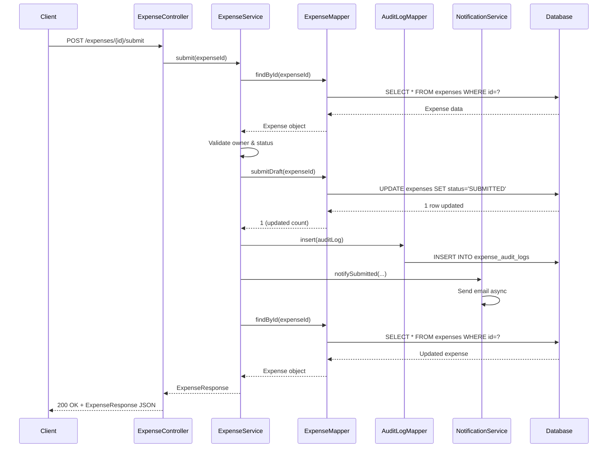

# Spring Boot Expenses Application - Comprehensive Architecture Analysis & Learning Guide

**Generated:** 2026-02-11
**Purpose:** Educational analysis to understand architecture, design patterns, and best practices

---

## Table of Contents

1. [Executive Summary](#executive-summary)
2. [Phase 1: Architecture Analysis](#phase-1-architecture-analysis)
3. [Phase 2: Design Patterns Deep Dive](#phase-2-design-patterns-deep-dive)
4. [Phase 3: SOLID Principles Assessment](#phase-3-solid-principles-assessment)
5. [Phase 4: Code Quality & Issues](#phase-4-code-quality--issues)
6. [Phase 5: Proposed Features with Learning](#phase-5-proposed-features-with-learning)
7. [Phase 6: Refactoring Roadmap](#phase-6-refactoring-roadmap)
8. [Phase 7: Learning Resources](#phase-7-learning-resources)

---

## Executive Summary

### What You Have Built

You've created a **solid foundation** for an enterprise expense management system with:
- ✅ Clean layered architecture (Controller → Service → Repository → Domain)
- ✅ Proper authentication and authorization with Spring Security
- ✅ Audit logging for compliance
- ✅ Optimistic locking for concurrent modifications
- ✅ Email notifications
- ✅ Comprehensive exception handling
- ✅ Database migrations with Flyway
- ✅ Integration testing with Testcontainers

### What You'll Learn

This document will teach you:
1. How to identify and apply design patterns in real-world scenarios
2. How to refactor code to follow SOLID principles
3. How to design for extensibility and maintainability
4. When to use interfaces vs concrete classes
5. How to properly use access modifiers for encapsulation
6. How to implement common enterprise features with best practices

### Current Maturity Level

**Architecture:** ⭐⭐⭐⭐☆ (4/5) - Good layering, minor improvements needed
**Code Quality:** ⭐⭐⭐☆☆ (3/5) - Functional but lacks abstraction
**Testability:** ⭐⭐⭐☆☆ (3/5) - Has tests but tight coupling limits testing
**Extensibility:** ⭐⭐☆☆☆ (2/5) - Hard to extend without modifying existing code
**Security:** ⭐⭐⭐⭐☆ (4/5) - Good security practices, minor improvements

---

## Phase 1: Architecture Analysis

### 1.1 Current Architecture Overview

Your application follows a **Layered (N-Tier) Architecture** pattern:

```
┌─────────────────────────────────────────────────────────────┐
│                     PRESENTATION LAYER                      │
│  ┌────────────────┐              ┌────────────────┐        │
│  │ REST Controller│              │ View Controller│        │
│  │  (ExpenseCtrl) │              │ (Thymeleaf)    │        │
│  └────────┬───────┘              └────────┬───────┘        │
└───────────┼──────────────────────────────┼─────────────────┘
            │                              │
            │        ┌─────────────────────┘
            │        │
┌───────────┼────────┼─────────────────────────────────────────┐
│           │        │      BUSINESS LOGIC LAYER               │
│           ▼        ▼                                         │
│  ┌─────────────────────────────────────────────┐            │
│  │         ExpenseService                      │            │
│  │  ┌──────────────────────────────────┐      │            │
│  │  │ - create()                        │      │            │
│  │  │ - submit()                        │      │            │
│  │  │ - approve()                       │      │            │
│  │  │ - reject()                        │      │            │
│  │  │ - search()                        │      │            │
│  │  └──────────────────────────────────┘      │            │
│  │  Dependencies:                              │            │
│  │  • ExpenseMapper                            │            │
│  │  • UserMapper                               │            │
│  │  • ExpenseAuditLogMapper                    │            │
│  │  • NotificationService                      │            │
│  │  • CreateCsvService                         │            │
│  └─────────────────────────────────────────────┘            │
│           │                                                  │
└───────────┼──────────────────────────────────────────────────┘
            │
┌───────────┼──────────────────────────────────────────────────┐
│           │         DATA ACCESS LAYER                        │
│           ▼                                                  │
│  ┌──────────────────────────────────────────┐               │
│  │ Repository Interfaces (MyBatis @Mapper)  │               │
│  │  - ExpenseMapper                         │               │
│  │  - UserMapper                            │               │
│  │  - ExpenseAuditLogMapper                 │               │
│  └──────────────────────────────────────────┘               │
│           │                                                  │
│           ▼                                                  │
│  ┌──────────────────────────────────────────┐               │
│  │ MyBatis XML Mappers (Dynamic SQL)        │               │
│  └──────────────────────────────────────────┘               │
└───────────┼──────────────────────────────────────────────────┘
            │
            ▼
    ┌──────────────┐
    │    MySQL     │
    │   Database   │
    └──────────────┘

CROSS-CUTTING CONCERNS:
┌────────────────────────────────────────────────────────┐
│ Security (Spring Security)                             │
│ • Authentication (Form Login + HTTP Basic)             │
│ • Authorization (Role-based: ROLE_APPROVER, etc.)      │
└────────────────────────────────────────────────────────┘
┌────────────────────────────────────────────────────────┐
│ Exception Handling                                     │
│ • GlobalApiExceptionHandler (REST)                     │
│ • GlobalViewExceptionHandler (Web)                     │
└────────────────────────────────────────────────────────┘
┌────────────────────────────────────────────────────────┐
│ Audit & Tracing                                        │
│ • TraceIdFilter (Request correlation)                  │
│ • ExpenseAuditLog (State changes)                      │
└────────────────────────────────────────────────────────┘
┌────────────────────────────────────────────────────────┐
│ Notifications                                          │
│ • NotificationService (Email)                          │
└────────────────────────────────────────────────────────┘
```

### 1.2 Component Interaction Diagram

Here's how components interact for a typical workflow (submitting an expense):



### 1.3 Domain Model

```
┌─────────────────────────────────────────────────────────┐
│                     DOMAIN ENTITIES                     │
├─────────────────────────────────────────────────────────┤
│                                                         │
│  ┌─────────────────────────────────────┐              │
│  │ Expense                             │              │
│  ├─────────────────────────────────────┤              │
│  │ - id: Long                          │              │
│  │ - applicantId: Long ──────────┐    │              │
│  │ - title: String                │    │              │
│  │ - amount: BigDecimal           │    │              │
│  │ - currency: String             │    │              │
│  │ - status: ExpenseStatus        │    │              │
│  │ - submittedAt: LocalDateTime   │    │              │
│  │ - createdAt: LocalDateTime     │    │              │
│  │ - updatedAt: LocalDateTime     │    │              │
│  │ - version: int (optimistic lock)   │              │
│  └─────────────────────────────────────┘              │
│                                         │              │
│  ┌─────────────────────────────────────┘              │
│  │                                                     │
│  │  ┌─────────────────────────────────────┐           │
│  └──│ User                                │           │
│     ├─────────────────────────────────────┤           │
│     │ - id: Long                          │           │
│     │ - email: String                     │           │
│     │ - password: String (BCrypt)         │           │
│     │ - roles: List<Role> ────────┐      │           │
│     └─────────────────────────────────────┘           │
│                                     │                 │
│                                     │                 │
│     ┌───────────────────────────────┘                 │
│     │                                                 │
│     │  ┌─────────────────────────────────────┐       │
│     └──│ Role                                │       │
│        ├─────────────────────────────────────┤       │
│        │ - id: Long                          │       │
│        │ - userId: Long                      │       │
│        │ - role: String                      │       │
│        │   (ROLE_APPLICANT, ROLE_APPROVER,   │       │
│        │    ROLE_ADMIN)                      │       │
│        │ - createdAt: LocalDateTime          │       │
│        │ - updatedAt: LocalDateTime          │       │
│        └─────────────────────────────────────┘       │
│                                                       │
│  ┌─────────────────────────────────────┐             │
│  │ ExpenseAuditLog                     │             │
│  ├─────────────────────────────────────┤             │
│  │ - id: Long                          │             │
│  │ - expenseId: Long                   │             │
│  │ - actorId: Long                     │             │
│  │ - action: String                    │             │
│  │ - beforeStatus: String              │             │
│  │ - afterStatus: String               │             │
│  │ - note: String                      │             │
│  │ - traceId: String                   │             │
│  │ - createdAt: LocalDateTime          │             │
│  └─────────────────────────────────────┘             │
│                                                       │
│  ┌─────────────────────────────────────┐             │
│  │ ExpenseStatus (Enum)                │             │
│  ├─────────────────────────────────────┤             │
│  │ - CREATE                            │             │
│  │ - DRAFT                             │             │
│  │ - SUBMIT                            │             │
│  │ - SUBMITTED                         │             │
│  │ - APPROVED                          │             │
│  │ - REJECTED                          │             │
│  └─────────────────────────────────────┘             │
└─────────────────────────────────────────────────────────┘
```

### 1.4 Key Architectural Decisions

#### ✅ Good Decisions

1. **Layered Architecture**
   - Clear separation of concerns
   - Each layer has a distinct responsibility
   - Easy to understand and navigate

2. **MyBatis for Data Access**
   - Fine-grained control over SQL
   - Dynamic SQL for complex queries
   - Good performance

3. **Spring Security Integration**
   - Industry-standard authentication
   - Role-based authorization
   - BCrypt password encoding

4. **Optimistic Locking**
   - Handles concurrent modifications
   - Good for low-conflict scenarios
   - Version field in Expense entity

5. **Audit Trail**
   - Complete history of state changes
   - Includes actor, action, and reason
   - Trace ID for request correlation

6. **Dual API Support**
   - REST API for programmatic access
   - Web forms for browser interaction

#### ⚠️ Areas for Improvement

1. **Lack of Abstractions**
   - Services depend directly on concrete mapper classes
   - No interfaces for services
   - Hard to mock for testing
   - Violates Dependency Inversion Principle

2. **Tight Coupling**
   - ExpenseService depends on 5 different components
   - Adding new features requires modifying existing service
   - Violates Open/Closed Principle

3. **Static Utility Class (CurrentUser)**
   - Makes testing difficult
   - Hidden dependency on SecurityContext
   - Should be injected as a dependency

4. **Anemic Domain Model**
   - Expense class is just a data container
   - Business logic lives in service layer
   - Domain entities don't encapsulate behavior

5. **No Service Interfaces**
   - Can't easily swap implementations
   - Can't use dynamic proxies for AOP
   - Harder to write focused unit tests

6. **Mixed Responsibilities in Service**
   - ExpenseService handles business logic, validation, notifications, CSV export
   - Should be split into smaller, focused services

---

## Phase 2: Design Patterns Deep Dive

Let me teach you the design patterns currently in use and those you should consider.

### 2.1 Patterns Currently Implemented

#### Pattern 1: Repository Pattern ⭐⭐⭐☆☆

**What it is:** Mediates between domain and data mapping layers, acting like an in-memory collection.

**Where it's used:**
- `ExpenseMapper` interface: src/main/java/com/example/expenses/repository/ExpenseMapper.java:16
- `UserMapper` interface: src/main/java/com/example/expenses/repository/UserMapper.java
- `ExpenseAuditLogMapper` interface: src/main/java/com/example/expenses/repository/ExpenseAuditLogMapper.java

**Current Implementation:**
```java
@Mapper
public interface ExpenseMapper {
    void insert(Expense expense);
    Expense findById(Long expenseId);
    List<Expense> search(ExpenseSearchCriteriaEntity criteria, ...);
    int approve(long id, int version);
    // ... more methods
}
```

**Grade: 3/5 - Partial Implementation**

**Why partial?**
- ✅ Abstracts data access
- ✅ Uses MyBatis for ORM
- ❌ No generic repository base
- ❌ Leaks persistence details (SQL specifics in XML)
- ❌ Returns domain entities directly (no DTOs at repo level)

**Learning Point - Repository Pattern Structure:**

```
┌─────────────────────────────────────────────┐
│  Service Layer                              │
│  ┌────────────────────────────────────┐    │
│  │ ExpenseService                     │    │
│  │ - depends on ExpenseRepository ────┼────┼──┐
│  └────────────────────────────────────┘    │  │
└─────────────────────────────────────────────┘  │
                                                  │
┌─────────────────────────────────────────────┐  │
│  Repository Layer                           │  │
│  ┌────────────────────────────────────┐    │  │
│  │ <<interface>>                      │◄───┘
│  │ ExpenseRepository                  │    │
│  │ + findById(id): Expense            │    │
│  │ + save(expense): void              │    │
│  │ + search(criteria): List           │    │
│  └────────────────┬───────────────────┘    │
│                   │ implements             │
│  ┌────────────────▼───────────────────┐    │
│  │ MyBatisExpenseRepository           │    │
│  │ (or JPAExpenseRepository)          │    │
│  └────────────────────────────────────┘    │
└─────────────────────────────────────────────┘
```

**Key Benefits:**
1. **Testability:** Can create in-memory repository for testing
2. **Flexibility:** Can switch from MyBatis to JPA without changing service
3. **Separation:** Domain model doesn't know about persistence

#### Pattern 2: Data Transfer Object (DTO) Pattern ⭐⭐⭐⭐☆

**What it is:** Objects that carry data between processes, reducing method calls.

**Where it's used:**
- Request DTOs: `ExpenseCreateRequest`, `ExpenseSearchCriteria`, `RejectRequest`
- Response DTOs: `ExpenseResponse`, `PaginationResponse`, `ExpenseAuditLogResponse`

**Example:**
```java
// src/main/java/com/example/expenses/dto/request/ExpenseCreateRequest.java
public record ExpenseCreateRequest(
    @NotBlank(message = "タイトルは必須です") String title,
    @NotNull(message = "金額は必須です") BigDecimal amount,
    String currency
) {}

// src/main/java/com/example/expenses/dto/response/ExpenseResponse.java
public record ExpenseResponse(
    Long id,
    Long applicantId,
    String title,
    BigDecimal amount,
    String currency,
    String status,
    LocalDateTime submittedAt,
    LocalDateTime createdAt,
    LocalDateTime updatedAt,
    int version
) {
    public static ExpenseResponse toResponse(Expense expense) {
        return new ExpenseResponse(
            expense.getId(),
            expense.getApplicantId(),
            // ... mapping
        );
    }
}
```

**Grade: 4/5 - Good Implementation**

**Why good?**
- ✅ Uses Java records (immutable by default)
- ✅ Clear separation between API contracts and domain model
- ✅ Validation annotations on request DTOs
- ✅ Static factory methods for conversion
- ❌ Conversion logic in DTOs (should be in mapper class)

**Learning Point - Why DTOs Matter:**

```
Without DTOs:
Client ───────────────> Domain Entity (Expense)
                        ↓
                     Exposes:
                     - Database IDs
                     - Internal structure
                     - Password fields
                     - Version numbers
                     - Cannot change without breaking clients

With DTOs:
Client ───────────────> ExpenseResponse (DTO)
                        ↓
                     Exposes:
                     - Only necessary fields
                     - Stable API contract
                     - Can add validation
                        ↓
                     Internal conversion
                        ↓
                     Domain Entity (Expense)
```

**Key Benefits:**
1. **API Stability:** Change domain without breaking clients
2. **Security:** Don't expose internal fields
3. **Validation:** Add constraints at API boundary
4. **Versioning:** Support multiple API versions

#### Pattern 3: Layered Architecture ⭐⭐⭐⭐☆

**Grade: 4/5 - Well Implemented**

Your application clearly separates:
1. **Presentation Layer:** Controllers
2. **Business Logic Layer:** Services
3. **Data Access Layer:** Repositories/Mappers
4. **Domain Layer:** Entities

**Learning Point - Layer Responsibilities:**

```
┌─────────────────────────────────────────────────────────┐
│ PRESENTATION LAYER                                      │
│ Responsibilities:                                       │
│ • HTTP request/response handling                        │
│ • Input validation (format, required fields)            │
│ • Authentication/Authorization checks                   │
│ • DTO conversion                                        │
│ • HTTP status codes                                     │
│                                                         │
│ ❌ DON'T: Business logic, database access               │
└─────────────────────────────────────────────────────────┘
                          │
                          ▼
┌─────────────────────────────────────────────────────────┐
│ BUSINESS LOGIC LAYER                                    │
│ Responsibilities:                                       │
│ • Core business rules                                   │
│ • Workflow orchestration                               │
│ • Transaction management                               │
│ • Business validation (status transitions)             │
│ • Calling other services                               │
│                                                         │
│ ❌ DON'T: HTTP details, SQL queries                     │
└─────────────────────────────────────────────────────────┘
                          │
                          ▼
┌─────────────────────────────────────────────────────────┐
│ DATA ACCESS LAYER                                       │
│ Responsibilities:                                       │
│ • CRUD operations                                       │
│ • Query construction                                    │
│ • Transaction execution                                │
│ • Data mapping (table ↔ object)                        │
│                                                         │
│ ❌ DON'T: Business logic, API concerns                  │
└─────────────────────────────────────────────────────────┘
```

#### Pattern 4: Dependency Injection (Constructor Injection) ⭐⭐⭐⭐⭐

**Grade: 5/5 - Excellent**

**Example from ExpenseService:**
```java
@Service
@RequiredArgsConstructor  // Lombok generates constructor
public class ExpenseService {

    private final ExpenseMapper expenseMapper;
    private final UserMapper userMapper;
    private final ExpenseAuditLogMapper auditLogMapper;
    private final NotificationService notificationService;
    private final CreateCsvService createCsvService;

    // Constructor automatically generated and dependencies injected
}
```

**Why this is excellent:**
- ✅ Immutable dependencies (final fields)
- ✅ Testable (can pass mocks in constructor)
- ✅ Clear dependencies visible in constructor
- ✅ No reflection magic during tests

### 2.2 Patterns You Should Know But Aren't Using

#### Pattern 5: Strategy Pattern 🎯 HIGH VALUE

**When to use:** When you have multiple algorithms/implementations for the same operation.

**Where it would help in your code:**

**Problem:** CSV export is hardcoded in ExpenseService. What if you need:
- PDF export?
- Excel export?
- JSON export?

Current approach would require modifying ExpenseService each time:
```java
public byte[] getCsv(...) { ... }
public byte[] getPdf(...) { ... }  // More methods!
public byte[] getExcel(...) { ... }
```

**Solution with Strategy Pattern:**

```java
// Step 1: Define the strategy interface
public interface ExportStrategy {
    byte[] export(List<Expense> expenses);
    String getContentType();
    String getFileExtension();
}

// Step 2: Implement concrete strategies
public class CsvExportStrategy implements ExportStrategy {
    @Override
    public byte[] export(List<Expense> expenses) {
        // CSV generation logic
        return csvBytes;
    }

    @Override
    public String getContentType() {
        return "text/csv";
    }

    @Override
    public String getFileExtension() {
        return "csv";
    }
}

public class PdfExportStrategy implements ExportStrategy {
    @Override
    public byte[] export(List<Expense> expenses) {
        // PDF generation logic
        return pdfBytes;
    }

    @Override
    public String getContentType() {
        return "application/pdf";
    }

    @Override
    public String getFileExtension() {
        return "pdf";
    }
}

// Step 3: Create a context that uses strategies
public class ExpenseExportService {
    private final Map<String, ExportStrategy> strategies;

    public ExpenseExportService(List<ExportStrategy> strategies) {
        // Spring will inject all ExportStrategy beans
        this.strategies = strategies.stream()
            .collect(Collectors.toMap(
                s -> s.getFileExtension(),
                s -> s
            ));
    }

    public byte[] export(List<Expense> expenses, String format) {
        ExportStrategy strategy = strategies.get(format);
        if (strategy == null) {
            throw new IllegalArgumentException("Unsupported format: " + format);
        }
        return strategy.export(expenses);
    }
}
```

**Benefits:**
1. ✅ **Open/Closed Principle:** Add new export formats without modifying existing code
2. ✅ **Single Responsibility:** Each strategy handles one format
3. ✅ **Testability:** Test each strategy independently
4. ✅ **Flexibility:** Can add/remove strategies at runtime

**Learning Exercise:**
After reading this, try to identify 3 other places in the codebase where Strategy Pattern would be useful.

Hint: Look for:
- Multiple conditional branches (if/else or switch)
- Different algorithms for the same operation
- Behavior that might change or need variants

#### Pattern 6: Factory Pattern 🎯 HIGH VALUE

**When to use:** When object creation is complex or you want to centralize creation logic.

**Where it would help:**

**Problem:** ExpenseAuditLog creation is scattered with factory methods:
```java
// src/main/java/com/example/expenses/dto/ExpenseAuditLog.java
public static ExpenseAuditLog create(Long expenseId, Long actorId, String traceId) { ... }
public static ExpenseAuditLog createDraft(Long expenseId, Long actorId, String traceId) { ... }
public static ExpenseAuditLog createApprove(Long expenseId, Long actorId, String traceId) { ... }
public static ExpenseAuditLog createReject(Long expenseId, Long actorId, String traceId, String reason) { ... }
```

This is good, but let's see a more advanced pattern:

**Solution with Factory Pattern:**

```java
// Step 1: Define factory interface
public interface AuditLogFactory {
    ExpenseAuditLog createLog(AuditContext context);
}

// Step 2: Value object for context
public record AuditContext(
    Long expenseId,
    Long actorId,
    String traceId,
    AuditAction action,
    ExpenseStatus beforeStatus,
    ExpenseStatus afterStatus,
    String note
) {}

// Step 3: Implement factory
@Component
public class ExpenseAuditLogFactory implements AuditLogFactory {

    @Override
    public ExpenseAuditLog createLog(AuditContext context) {
        ExpenseAuditLog log = new ExpenseAuditLog();
        log.setExpenseId(context.expenseId());
        log.setActorId(context.actorId());
        log.setAction(context.action());
        log.setBeforeStatus(context.beforeStatus());
        log.setAfterStatus(context.afterStatus());
        log.setNote(context.note());
        log.setTraceId(context.traceId());
        log.setCreatedAt(LocalDateTime.now());
        return log;
    }

    // Convenience methods
    public ExpenseAuditLog forCreation(Long expenseId, Long actorId, String traceId) {
        return createLog(new AuditContext(
            expenseId, actorId, traceId,
            AuditAction.CREATE,
            null, ExpenseStatus.DRAFT, null
        ));
    }

    public ExpenseAuditLog forApproval(Long expenseId, Long actorId, String traceId) {
        return createLog(new AuditContext(
            expenseId, actorId, traceId,
            AuditAction.APPROVE,
            ExpenseStatus.SUBMITTED, ExpenseStatus.APPROVED, null
        ));
    }
}
```

**Benefits:**
1. ✅ **Centralized Creation:** All audit log creation in one place
2. ✅ **Testability:** Can mock the factory
3. ✅ **Flexibility:** Can change creation logic without affecting callers
4. ✅ **Validation:** Can add validation rules in factory

#### Pattern 7: Observer Pattern (Event-Driven) 🎯 VERY HIGH VALUE

**When to use:** When multiple components need to react to an event without tight coupling.

**Current Problem in Your Code:**

In `ExpenseService.approve()`:
```java
// Line 138-176 of ExpenseService.java
public ExpenseResponse approve(long expenseId, int version, Long actorId) {
    // ... approval logic ...

    // Directly calling notification service - tight coupling!
    notificationService.notifyApproved(...);

    // What if you need to:
    // - Update analytics?
    // - Send Slack notification?
    // - Update a cache?
    // You'd have to modify this method each time!
}
```

**Solution with Observer Pattern (Spring Events):**

```java
// Step 1: Define domain events
public abstract class ExpenseEvent {
    private final Long expenseId;
    private final Long actorId;
    private final String traceId;
    private final LocalDateTime occurredAt;

    // constructor, getters...
}

public class ExpenseApprovedEvent extends ExpenseEvent {
    private final Long approverId;
    private final Long applicantId;

    public ExpenseApprovedEvent(Long expenseId, Long approverId,
                                Long applicantId, String traceId) {
        super(expenseId, approverId, traceId);
        this.approverId = approverId;
        this.applicantId = applicantId;
    }
}

public class ExpenseRejectedEvent extends ExpenseEvent {
    private final String reason;
    // ...
}

public class ExpenseSubmittedEvent extends ExpenseEvent {
    // ...
}

// Step 2: Publish events in service
@Service
@RequiredArgsConstructor
public class ExpenseService {

    private final ApplicationEventPublisher eventPublisher;
    private final ExpenseMapper expenseMapper;
    // ... other dependencies ...

    @Transactional
    public ExpenseResponse approve(long expenseId, int version, Long actorId) {
        // ... approval logic ...

        // Publish event instead of directly calling notification
        eventPublisher.publishEvent(
            new ExpenseApprovedEvent(expenseId, actorId,
                                    expense.getApplicantId(), traceId())
        );

        return ExpenseResponse.toResponse(saved);
    }
}

// Step 3: Create event listeners
@Component
@Slf4j
public class ExpenseNotificationListener {

    private final NotificationService notificationService;
    private final UserMapper userMapper;

    @EventListener
    @Async  // Run asynchronously!
    public void handleExpenseApproved(ExpenseApprovedEvent event) {
        try {
            String applicantEmail = userMapper.findEmailById(event.getApplicantId());
            notificationService.notifyApproved(
                applicantEmail,
                event.getExpenseId(),
                event.getTraceId()
            );
        } catch (Exception e) {
            log.error("Failed to send approval notification", e);
        }
    }

    @EventListener
    public void handleExpenseRejected(ExpenseRejectedEvent event) {
        // Handle rejection notification
    }
}

// Step 4: Add more listeners without changing ExpenseService!
@Component
public class ExpenseAnalyticsListener {

    private final AnalyticsService analyticsService;

    @EventListener
    public void handleExpenseApproved(ExpenseApprovedEvent event) {
        // Track approval metrics
        analyticsService.recordApproval(event.getExpenseId());
    }
}

@Component
public class ExpenseCacheListener {

    private final CacheManager cacheManager;

    @EventListener
    public void handleExpenseApproved(ExpenseApprovedEvent event) {
        // Invalidate cache
        cacheManager.evict("expenses", event.getExpenseId());
    }
}
```

**Benefits:**
1. ✅ **Loose Coupling:** ExpenseService doesn't know about listeners
2. ✅ **Open/Closed:** Add new listeners without modifying service
3. ✅ **Async Processing:** Notifications don't slow down main operation
4. ✅ **Testability:** Can test service without notification logic
5. ✅ **Single Responsibility:** Each listener has one job

**This is a FUNDAMENTAL pattern you should implement!**

#### Pattern 8: Specification Pattern 🎯 MEDIUM VALUE

**When to use:** Complex business rules that need to be combined or reused.

**Where it would help:** The search criteria in ExpenseService has complex logic:

Current code (src/main/java/com/example/expenses/service/ExpenseService.java:64-102):
```java
public PaginationResponse<ExpenseResponse> search(
    ExpenseSearchCriteria criteria, ...) {

    ExpenseSearchCriteriaEntity e = new ExpenseSearchCriteriaEntity();
    e.setTitle(criteria.title());
    // ... setting all fields ...

    // Business rule: non-approvers can only see their own
    if(!roles.contains("ROLE_APPROVER")) {
        e.setApplicantId(actorId);
    }
    // ... more logic ...
}
```

**Solution with Specification Pattern:**

```java
// Step 1: Define specification interface
public interface Specification<T> {
    boolean isSatisfiedBy(T candidate);

    // Combinators for complex rules
    default Specification<T> and(Specification<T> other) {
        return candidate -> this.isSatisfiedBy(candidate) &&
                           other.isSatisfiedBy(candidate);
    }

    default Specification<T> or(Specification<T> other) {
        return candidate -> this.isSatisfiedBy(candidate) ||
                           other.isSatisfiedBy(candidate);
    }

    default Specification<T> not() {
        return candidate -> !this.isSatisfiedBy(candidate);
    }
}

// Step 2: Implement concrete specifications
public class ExpenseByStatusSpecification implements Specification<Expense> {
    private final ExpenseStatus status;

    public ExpenseByStatusSpecification(ExpenseStatus status) {
        this.status = status;
    }

    @Override
    public boolean isSatisfiedBy(Expense expense) {
        return expense.getStatus() == status;
    }
}

public class ExpenseByOwnerSpecification implements Specification<Expense> {
    private final Long ownerId;

    @Override
    public boolean isSatisfiedBy(Expense expense) {
        return expense.getApplicantId().equals(ownerId);
    }
}

public class ExpenseWithinAmountRangeSpecification implements Specification<Expense> {
    private final BigDecimal min;
    private final BigDecimal max;

    @Override
    public boolean isSatisfiedBy(Expense expense) {
        return expense.getAmount().compareTo(min) >= 0 &&
               expense.getAmount().compareTo(max) <= 0;
    }
}

// Step 3: Compose specifications
public class ExpenseSpecifications {

    public static Specification<Expense> visibleToUser(Long userId, List<String> roles) {
        if (roles.contains("ROLE_APPROVER")) {
            // Approvers see all
            return expense -> true;
        } else {
            // Users see only their own
            return new ExpenseByOwnerSpecification(userId);
        }
    }

    public static Specification<Expense> matchingSearchCriteria(
        ExpenseSearchCriteria criteria, Long userId, List<String> roles) {

        Specification<Expense> spec = visibleToUser(userId, roles);

        if (criteria.status() != null) {
            spec = spec.and(new ExpenseByStatusSpecification(
                ExpenseStatus.valueOf(criteria.status())
            ));
        }

        if (criteria.amountMin() != null && criteria.amountMax() != null) {
            spec = spec.and(new ExpenseWithinAmountRangeSpecification(
                criteria.amountMin(), criteria.amountMax()
            ));
        }

        return spec;
    }
}

// Step 4: Use in service
public PaginationResponse<ExpenseResponse> search(...) {
    Specification<Expense> spec = ExpenseSpecifications
        .matchingSearchCriteria(criteria, actorId, roles);

    // Apply specification to query...
}
```

**Benefits:**
1. ✅ **Reusability:** Specifications can be reused across queries
2. ✅ **Composability:** Combine simple rules into complex ones
3. ✅ **Testability:** Test each rule independently
4. ✅ **Readability:** Business rules are explicit

#### Pattern 9: Builder Pattern 🎯 MEDIUM VALUE

**When to use:** Objects with many optional parameters or complex construction.

**Where it would help:** Creating test data or complex DTOs.

**Example:**

```java
// Current: Using constructor with many nulls
ExpenseSearchCriteria criteria = new ExpenseSearchCriteria(
    null,  // applicantId
    "SUBMITTED",  // status
    null,  // title
    null,  // sort
    new BigDecimal("100"),  // amountMin
    new BigDecimal("1000"),  // amountMax
    null,  // submittedFrom
    null   // submittedTo
);

// With Builder:
ExpenseSearchCriteria criteria = ExpenseSearchCriteria.builder()
    .status("SUBMITTED")
    .amountMin(new BigDecimal("100"))
    .amountMax(new BigDecimal("1000"))
    .build();
```

**Implementation with Lombok:**
```java
@Builder
public record ExpenseSearchCriteria(
    Long applicantId,
    String status,
    String title,
    String sort,
    BigDecimal amountMin,
    BigDecimal amountMax,
    LocalDate submittedFrom,
    LocalDate submittedTo
) {}
```

### 2.3 Anti-Patterns to Avoid

#### Anti-Pattern 1: Static Utility Classes 🚫

**Found in:** `CurrentUser` class (src/main/java/com/example/expenses/util/CurrentUser.java)

```java
public final class CurrentUser {
    private CurrentUser() {}

    public static Long actorId() {
        // Static access to SecurityContext
        var auth = SecurityContextHolder.getContext().getAuthentication();
        // ...
    }
}
```

**Why is this bad?**
1. ❌ **Hard to test:** Can't mock static methods easily
2. ❌ **Hidden dependency:** Not visible in constructor
3. ❌ **Thread safety concerns:** Global state access
4. ❌ **Violates Dependency Injection principles**

**Better Alternative:**

```java
// Create a proper service
@Component
public class AuthenticationContext {

    public Long getCurrentUserId() {
        var auth = SecurityContextHolder.getContext().getAuthentication();
        if (auth.getPrincipal() instanceof LoginUser loginUser) {
            return loginUser.getUserId();
        }
        throw new IllegalStateException("User not authenticated");
    }

    public List<String> getCurrentUserRoles() {
        // ...
    }

    public boolean isCurrentUserOwnerOrApprover(Long ownerId) {
        // ...
    }
}

// Inject it
@Service
@RequiredArgsConstructor
public class ExpenseService {
    private final AuthenticationContext authContext;  // Injected!

    public ExpenseResponse create(ExpenseCreateRequest req) {
        Long userId = authContext.getCurrentUserId();  // No static!
        // ...
    }
}
```

**Benefits of refactoring:**
1. ✅ Visible dependencies
2. ✅ Mockable for testing
3. ✅ Can add caching, logging easily
4. ✅ Can inject different implementations

#### Anti-Pattern 2: God Class/Service 🚫

**Found in:** `ExpenseService` has too many responsibilities

ExpenseService currently handles:
1. Creating expenses
2. Searching expenses
3. Submitting expenses
4. Approving expenses
5. Rejecting expenses
6. Sending notifications
7. Exporting to CSV
8. User lookup
9. Pagination logic
10. Sort validation

This violates Single Responsibility Principle!

**Better Alternative:**

```
ExpenseService (Core operations only)
  ├─ ExpenseCreationService (Create, draft)
  ├─ ExpenseApprovalService (Approve, reject)
  ├─ ExpenseSearchService (Search, filter, pagination)
  ├─ ExpenseExportService (CSV, PDF, Excel)
  └─ ExpenseNotificationService (Email, Slack)
```

---

## Phase 3: SOLID Principles Assessment

Let me analyze how well your code follows each SOLID principle with specific examples.

### 3.1 Single Responsibility Principle (SRP)

**Principle:** A class should have only one reason to change.

#### ❌ Violations Found

**Violation 1: ExpenseService**
- **File:** src/main/java/com/example/expenses/service/ExpenseService.java:33
- **Reasons to change:**
  1. Business logic changes (approve/reject rules)
  2. Search algorithm changes
  3. Export format changes
  4. Notification logic changes
  5. Pagination logic changes
  6. Sort validation changes

**Impact:** Every change risks breaking unrelated functionality.

**Fix:**
```java
// Split into focused services
@Service
public class ExpenseLifecycleService {
    // Only: create, submit, approve, reject
}

@Service
public class ExpenseSearchService {
    // Only: search, filter, pagination
}

@Service
public class ExpenseExportService {
    // Only: export to various formats
}
```

**Violation 2: CurrentUser Utility**
- **File:** src/main/java/com/example/expenses/util/CurrentUser.java:15
- **Does:**
  1. Authentication (getting user ID)
  2. Authorization (checking roles)
  3. String manipulation (email display name)

**Fix:** Split into `AuthenticationContext` and `AuthorizationService`

#### ✅ Good Examples

**Good Example 1: NotificationService**
- Single responsibility: Send notifications
- Only changes when notification logic changes
- Well-focused

**Good Example 2: ExpenseCreateRequest**
- Single responsibility: Validate request data
- Only changes when API contract changes

### 3.2 Open/Closed Principle (OCP)

**Principle:** Classes should be open for extension but closed for modification.

#### ❌ Violations Found

**Violation 1: Adding New Export Formats**

To add PDF export, you must modify ExpenseService:
```java
// Have to modify existing code
public byte[] getCsv(...) { ... }
public byte[] getPdf(...) { ... }  // NEW: Modifying class!
```

**Better:** Strategy pattern (shown in Phase 2)
```java
// Adding new format = new class, no modifications
@Component
public class PdfExportStrategy implements ExportStrategy {
    // New functionality without touching existing code
}
```

**Violation 2: Adding New Audit Actions**

To add new action type, must modify:
1. ExpenseAuditLog factory methods
2. Enum definitions
3. Potentially service methods

**Better:** Use polymorphism or strategy

#### ✅ Good Examples

**Good Example 1: Spring Security Configuration**
- Can add new URL patterns without changing SecurityConfig internals
- Uses builder pattern for configuration

**Good Example 2: MyBatis Dynamic SQL**
- Can add new search criteria without modifying Java code
- XML handles variations

### 3.3 Liskov Substitution Principle (LSP)

**Principle:** Subtypes must be substitutable for their base types.

#### Analysis

Your code doesn't use much inheritance, which is actually good! You're avoiding a common source of LSP violations.

**What you're doing right:**
- Using interfaces for repositories (MyBatis mappers)
- Using composition over inheritance
- Minimal class hierarchies

**Watch out for:**
If you add inheritance, ensure child classes don't:
1. Throw new exceptions not in parent
2. Strengthen preconditions (require more than parent)
3. Weaken postconditions (guarantee less than parent)

**Example of potential violation to avoid:**

```java
// DON'T DO THIS:
public class ExpenseService {
    public ExpenseResponse approve(long id, int version, Long actorId) {
        // Base behavior
    }
}

public class PriorityExpenseService extends ExpenseService {
    @Override
    public ExpenseResponse approve(long id, int version, Long actorId) {
        // VIOLATION: Adding new requirement
        if (someNewCondition) {
            throw new UnsupportedOperationException("Priority expenses can't be approved on weekends");
        }
        return super.approve(id, version, actorId);
    }
}
```

**Better:** Use composition:
```java
public interface ApprovalPolicy {
    void validateApproval(Expense expense);
}

public class StandardApprovalPolicy implements ApprovalPolicy { ... }
public class PriorityApprovalPolicy implements ApprovalPolicy { ... }

@Service
public class ExpenseApprovalService {
    private final ApprovalPolicy policy;
    // Inject appropriate policy
}
```

### 3.4 Interface Segregation Principle (ISP)

**Principle:** Clients shouldn't depend on interfaces they don't use.

#### ❌ Violations Found

**Violation 1: ExpenseMapper Interface**
- **File:** src/main/java/com/example/expenses/repository/ExpenseMapper.java:16

```java
@Mapper
public interface ExpenseMapper {
    void insert(Expense expense);
    Expense findById(Long expenseId);
    int submitDraft(Long expenseId);
    List<Expense> search(...);  // Complex search
    long count(...);
    int approve(long id, int version);
    int reject(long id, int version);
    List<Expense> findByUserId(Long applicantId);
    List<Expense> filter(...);  // CSV export
}
```

**Problem:** A class that only needs to read expenses must depend on all these write methods!

**Better:** Split into focused interfaces:
```java
public interface ExpenseReader {
    Expense findById(Long expenseId);
    List<Expense> search(...);
    long count(...);
}

public interface ExpenseWriter {
    void insert(Expense expense);
    int update(Expense expense);
}

public interface ExpenseWorkflowOperations {
    int submitDraft(Long expenseId);
    int approve(long id, int version);
    int reject(long id, int version);
}

// MyBatis implementation implements all
@Mapper
public interface ExpenseMapper extends ExpenseReader,
                                      ExpenseWriter,
                                      ExpenseWorkflowOperations {
    // Implementation of all interfaces
}

// But services only depend on what they need
public class ExpenseSearchService {
    private final ExpenseReader expenseReader;  // Only read operations!
}

public class ExpenseApprovalService {
    private final ExpenseWorkflowOperations workflowOps;  // Only workflow!
}
```

### 3.5 Dependency Inversion Principle (DIP)

**Principle:** Depend on abstractions, not concretions.

#### ❌ Violations Found

**Violation 1: Services Depend on Concrete Mappers**

```java
@Service
public class ExpenseService {
    private final ExpenseMapper expenseMapper;  // Concrete MyBatis interface!
    private final UserMapper userMapper;        // Concrete MyBatis interface!
    // ...
}
```

**Why is this a problem?**
- ExpenseService depends on MyBatis-specific interface
- Can't easily switch to JPA or other ORM
- Harder to create test doubles

**Better:**

```java
// High-level abstraction
public interface ExpenseRepository {
    Expense findById(Long id);
    void save(Expense expense);
    List<Expense> findByCriteria(ExpenseSearchCriteria criteria);
}

// Low-level implementation
@Repository
public class MyBatisExpenseRepository implements ExpenseRepository {
    private final ExpenseMapper mapper;  // MyBatis detail hidden here

    @Override
    public Expense findById(Long id) {
        return mapper.findById(id);
    }
    // ... delegate to MyBatis mapper
}

// Service depends on abstraction
@Service
public class ExpenseService {
    private final ExpenseRepository expenseRepository;  // Abstract interface!
}
```

**Violation 2: No Service Interfaces**

Your services are concrete classes with no interfaces:
```java
@Service
public class ExpenseService { ... }  // No interface
```

**Problem:**
- Can't use dynamic proxies for AOP
- Harder to create mocks
- Can't have multiple implementations

**Better:**

```java
public interface IExpenseService {
    ExpenseResponse create(ExpenseCreateRequest req);
    ExpenseResponse submit(Long expenseId);
    ExpenseResponse approve(long expenseId, int version, Long actorId);
    // ...
}

@Service
public class ExpenseServiceImpl implements IExpenseService {
    // Implementation
}

// Controllers depend on interface
@RestController
public class ExpenseController {
    private final IExpenseService expenseService;  // Interface!
}
```

#### ✅ Good Examples

**Good Example: Using Spring's Interfaces**
```java
@Component
public class NotificationService {
    private final JavaMailSender mailSender;  // Spring interface, not concrete!
}
```

### 3.6 SOLID Compliance Summary

| Principle | Grade | Key Issues | Priority to Fix |
|-----------|-------|------------|----------------|
| Single Responsibility | ⭐⭐☆☆☆ | God service classes | 🔴 HIGH |
| Open/Closed | ⭐⭐☆☆☆ | Must modify for extensions | 🔴 HIGH |
| Liskov Substitution | ⭐⭐⭐⭐☆ | Not much inheritance (good!) | 🟢 LOW |
| Interface Segregation | ⭐⭐☆☆☆ | Fat interfaces | 🟡 MEDIUM |
| Dependency Inversion | ⭐⭐☆☆☆ | Depends on concrete classes | 🔴 HIGH |

---

## Phase 4: Code Quality & Issues

### 4.1 Code Smells Identified

#### Smell 1: Long Method 🟡

**Location:** ExpenseService.search() (lines 64-102)

**Complexity:** 38 lines doing:
1. DTO conversion
2. Authorization logic
3. Sort validation
4. Pagination calculation
5. Database query
6. Response mapping

**Cyclomatic Complexity:** ~6

**Refactor:**
```java
public PaginationResponse<ExpenseResponse> search(
        ExpenseSearchCriteria criteria,
        int currentPage,
        int pageSize,
        Long actorId,
        List<String> roles) {

    // Extract to methods
    ExpenseSearchCriteriaEntity searchCriteria =
        buildSearchCriteria(criteria, actorId, roles);

    SortConfiguration sort =
        validateAndNormalizeSorting(criteria.sort());

    PageConfiguration page =
        calculatePagination(currentPage, pageSize);

    List<Expense> results =
        expenseMapper.search(searchCriteria, sort.column(),
                           sort.direction(), page.size(), page.offset());

    return buildPaginationResponse(results, currentPage, pageSize,
                                  expenseMapper.count(searchCriteria));
}
```

#### Smell 2: Feature Envy 🟡

**Location:** ExpenseService has multiple private methods accessing external data

```java
private String getApplicantAddress(Long applicantId) {
    return userMapper.findEmailById(applicantId);
}
private String getApproverAddress() {
    return userMapper.findAnyApproverEmail();
}
```

**Problem:** ExpenseService is "envious" of User data.

**Better:** Move to UserService:
```java
@Service
public class UserService {
    public String getUserEmail(Long userId) { ... }
    public String getAnyApproverEmail() { ... }
}
```

#### Smell 3: Magic Numbers & Strings 🟡

**Location:** Throughout the code

```java
// ExpenseService.java:41
private static final Set<String> ALLOWED_SORTS =
    Set.of("created_at", "updated_at", "submitted_at", "amount", "id");

// Line 96: Magic number
List<Integer> pageList = pageList(currentPage, totalPage, 5);  // What's 5?
```

**Better:**
```java
private static final int DEFAULT_PAGE_LIST_SIZE = 5;
private static final Set<SortField> ALLOWED_SORTS =
    Set.of(SortField.CREATED_AT, SortField.UPDATED_AT, ...);
```

#### Smell 4: Primitive Obsession 🔴

**Location:** Passing many primitives instead of objects

```java
// ExpenseMapper.java:45-50
public List<Expense> search(
    @Param("criteria") ExpenseSearchCriteriaEntity criteria,
    @Param("orderBy") String orderBy,       // Primitive
    @Param("direction") String direction,   // Primitive
    @Param("size") int size,                // Primitive
    @Param("offset") int offset             // Primitive
);
```

**Better:**
```java
public record SortConfiguration(String column, SortDirection direction) {}
public record PageConfiguration(int size, int offset) {}

public List<Expense> search(
    ExpenseSearchCriteria criteria,
    SortConfiguration sort,
    PageConfiguration page
);
```

#### Smell 5: Anemic Domain Model 🔴

**Location:** Expense entity (src/main/java/com/example/expenses/domain/Expense.java:9)

```java
@Data
public class Expense {
    private Long id;
    private Long applicantId;
    private String title;
    private BigDecimal amount;
    private String currency;
    private ExpenseStatus status;
    // ... just getters/setters, no behavior!
}
```

**Problem:** No business logic in domain objects. They're just data bags.

**Rich Domain Model:**
```java
public class Expense {
    private Long id;
    private Long applicantId;
    private String title;
    private Money amount;  // Value object instead of BigDecimal
    private ExpenseStatus status;
    private int version;
    private LocalDateTime submittedAt;

    // Business logic belongs here!
    public void submit() {
        if (this.status != ExpenseStatus.DRAFT) {
            throw new IllegalStateException(
                "Only draft expenses can be submitted"
            );
        }
        this.status = ExpenseStatus.SUBMITTED;
        this.submittedAt = LocalDateTime.now();
    }

    public void approve(Long approverId) {
        if (this.status != ExpenseStatus.SUBMITTED) {
            throw new IllegalStateException(
                "Only submitted expenses can be approved"
            );
        }
        this.status = ExpenseStatus.APPROVED;
    }

    public void reject(Long approverId, String reason) {
        if (this.status != ExpenseStatus.SUBMITTED) {
            throw new IllegalStateException(
                "Only submitted expenses can be rejected"
            );
        }
        if (reason == null || reason.isBlank()) {
            throw new IllegalArgumentException(
                "Rejection reason is required"
            );
        }
        this.status = ExpenseStatus.REJECTED;
    }

    public boolean canBeSubmittedBy(Long userId) {
        return this.applicantId.equals(userId) &&
               this.status == ExpenseStatus.DRAFT;
    }

    public boolean canBeApproved() {
        return this.status == ExpenseStatus.SUBMITTED;
    }

    public Money getAmountInUSD() {
        // Currency conversion logic
    }
}
```

**Benefits:**
1. ✅ Business rules are enforced
2. ✅ Can't create invalid states
3. ✅ Self-documenting
4. ✅ Easier to test

### 4.2 Security Concerns

#### Security Issue 1: SQL Injection Risk 🔴

**Location:** ExpenseMapper.xml dynamic SQL

```xml
<!-- Line 47-48 -->
ORDER BY ${orderBy} ${direction}
```

**Problem:** Using `${}` instead of `#{}` - direct string substitution!

**Risk:** If `orderBy` comes from user input, it's vulnerable to SQL injection.

**Current Mitigation:** You validate in service (normalizedOrderBy method) ✅

**Better:** Use `<choose>` in MyBatis:
```xml
<select id="search" ...>
    SELECT * FROM expenses
    WHERE ...
    ORDER BY
    <choose>
        <when test="orderBy == 'created_at'">created_at</when>
        <when test="orderBy == 'amount'">amount</when>
        <otherwise>created_at</otherwise>
    </choose>
    <choose>
        <when test="direction == 'ASC'">ASC</when>
        <otherwise>DESC</otherwise>
    </choose>
</select>
```

#### Security Issue 2: Sensitive Data in Logs 🟡

**Location:** ExpenseService.java:53

```java
log.info("Expense{}", expense);
```

**Problem:** Logging entire expense object including amounts.

**Better:**
```java
log.info("Expense created: id={}, applicantId={}",
         expense.getId(), expense.getApplicantId());
```

#### Security Issue 3: Email Extraction Logic 🟡

**Location:** CurrentUser.java:49-50

```java
var temp = loginUser.getUsername();
var displayName = temp.substring(0, temp.split("@")[0].length());
```

**Problem:** Fragile string manipulation. What if username isn't an email?

**Better:**
```java
String username = loginUser.getUsername();
int atIndex = username.indexOf('@');
String displayName = atIndex > 0 ? username.substring(0, atIndex) : username;
```

### 4.3 Performance Concerns

#### Performance Issue 1: N+1 Query Problem 🟡

**Location:** ExpenseService.approve() and reject()

```java
// Line 140: Query 1
Expense expense = expenseMapper.findById(expenseId);

// Line 156: Query 2 (update)
int updated = expenseMapper.approve(expenseId, version);

// Line 172: Query 3
var saved = expenseMapper.findById(expenseId);

// Line 166: Query 4 (user lookup)
notificationService.notifyApproved(
    getApplicantAddress(expense.getApplicantId()), ...);
```

**Issue:** 4 queries when 2-3 would suffice.

**Better:** Return updated entity from UPDATE:
```sql
UPDATE expenses
SET status = 'APPROVED', version = version + 1
WHERE id = ? AND version = ?
RETURNING *;
```

Or fetch user data in first query with JOIN.

#### Performance Issue 2: No Caching 🟡

**Opportunities:**
1. User emails (frequently accessed, rarely change)
2. Approver lists
3. Expense counts for pagination

**Add caching:**
```java
@Service
public class UserService {

    @Cacheable(value = "userEmails", key = "#userId")
    public String getUserEmail(Long userId) {
        return userMapper.findEmailById(userId);
    }

    @Cacheable(value = "approverEmails")
    public String getAnyApproverEmail() {
        return userMapper.findAnyApproverEmail();
    }
}
```

#### Performance Issue 3: CSV Export Without Pagination 🔴

**Location:** ExpenseService.getCsv() (line 217-221)

```java
public byte[] getCsv(ExpenseSearchCriteria criteria) {
    List<Expense> list = expenseMapper.filter(...);  // ALL rows!
    return createCsvService.createCsv(list);
}
```

**Problem:** Loads all matching rows into memory. Could be thousands!

**Better:**
1. Add limit: "Export only first 10,000 rows"
2. Use streaming: Process and write rows one at a time
3. Async export: Generate file in background, notify when ready

### 4.4 Testability Issues

#### Issue 1: Hard to Mock Static Methods 🔴

**Location:** CurrentUser utility class

```java
@Service
public class ExpenseService {
    public ExpenseResponse create(ExpenseCreateRequest req) {
        Expense expense = new Expense();
        expense.setApplicantId(CurrentUser.actorId());  // Static call!
        // ...
    }
}
```

**Problem:** Can't mock `CurrentUser.actorId()` in unit tests easily.

**Better:** Inject as dependency (shown earlier).

#### Issue 2: No Service Interfaces 🟡

**Current:**
```java
@Service
public class ExpenseService { ... }
```

**Problem:** Must use concrete class in tests.

**Better:**
```java
public interface IExpenseService { ... }

@Service
public class ExpenseServiceImpl implements IExpenseService { ... }

// In tests:
@Mock
private IExpenseService expenseService;  // Easy to mock!
```

#### Issue 3: Tight Coupling to Infrastructure 🔴

**Example:** Services directly depend on MyBatis mappers.

**Better:** Use repository pattern with interfaces.

### 4.5 Maintainability Concerns

#### Concern 1: Duplication in MyBatis XML 🟡

**Location:** ExpenseMapper.xml

The `search` and `count` queries have duplicate WHERE clauses (lines 23-45 and 57-79).

**Better:** Use `<sql>` fragments:
```xml
<sql id="searchConditions">
    <if test="criteria.applicantId != null">
        AND applicant_id = #{criteria.applicantId}
    </if>
    <!-- ... all conditions ... -->
</sql>

<select id="search" ...>
    SELECT * FROM expenses
    WHERE 1=1
    <include refid="searchConditions"/>
    ORDER BY ${orderBy} ${direction}
</select>

<select id="count" ...>
    SELECT COUNT(*) FROM expenses
    WHERE 1=1
    <include refid="searchConditions"/>
</select>
```

#### Concern 2: Mixed Languages (Comments) 🟡

**Location:** Throughout codebase

```java
//本人以外とROLE_APPROVER以外は全て見れない
if(!roles.contains("ROLE_APPROVER")) {
    e.setApplicantId(actorId);
}
```

**Issue:** Mixing Japanese and English comments makes code less accessible.

**Better:** Choose one language (English for open-source, Japanese if team prefers).

#### Concern 3: No API Versioning 🟡

**Current:** All APIs at root level: `/expenses`, `/register`

**Future Problem:** Breaking changes require new endpoints.

**Better:**
```java
@RestController
@RequestMapping("/api/v1/expenses")
public class ExpenseController { ... }
```

### 4.6 Code Quality Summary

| Category | Grade | Key Issues | Priority |
|----------|-------|------------|----------|
| Code Smells | ⭐⭐⭐☆☆ | Anemic domain, primitive obsession | 🔴 HIGH |
| Security | ⭐⭐⭐⭐☆ | SQL injection mitigation present | 🟢 LOW |
| Performance | ⭐⭐⭐☆☆ | No caching, N+1 queries | 🟡 MEDIUM |
| Testability | ⭐⭐☆☆☆ | Static methods, no interfaces | 🔴 HIGH |
| Maintainability | ⭐⭐⭐☆☆ | Some duplication | 🟡 MEDIUM |

---

**Continued in next section...**
